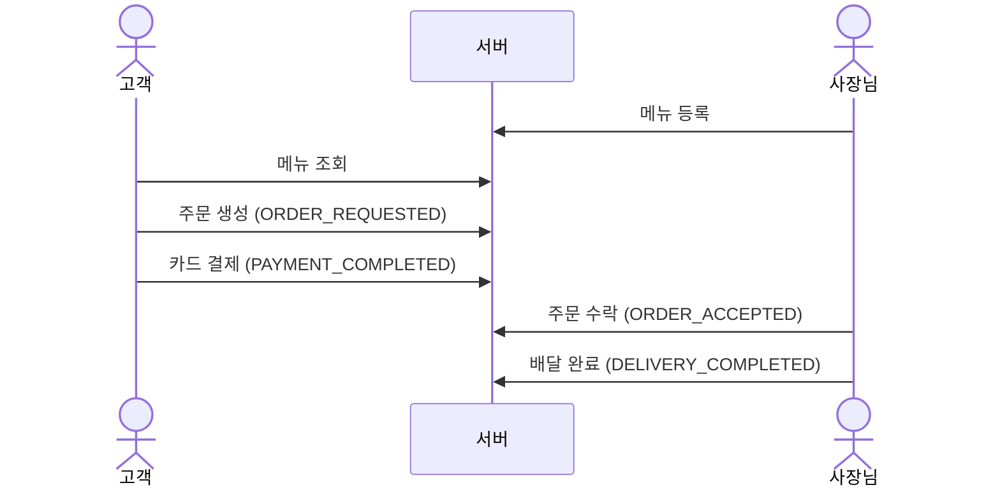
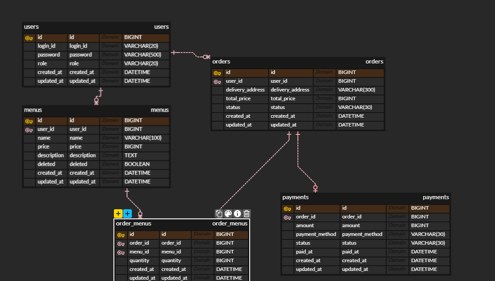
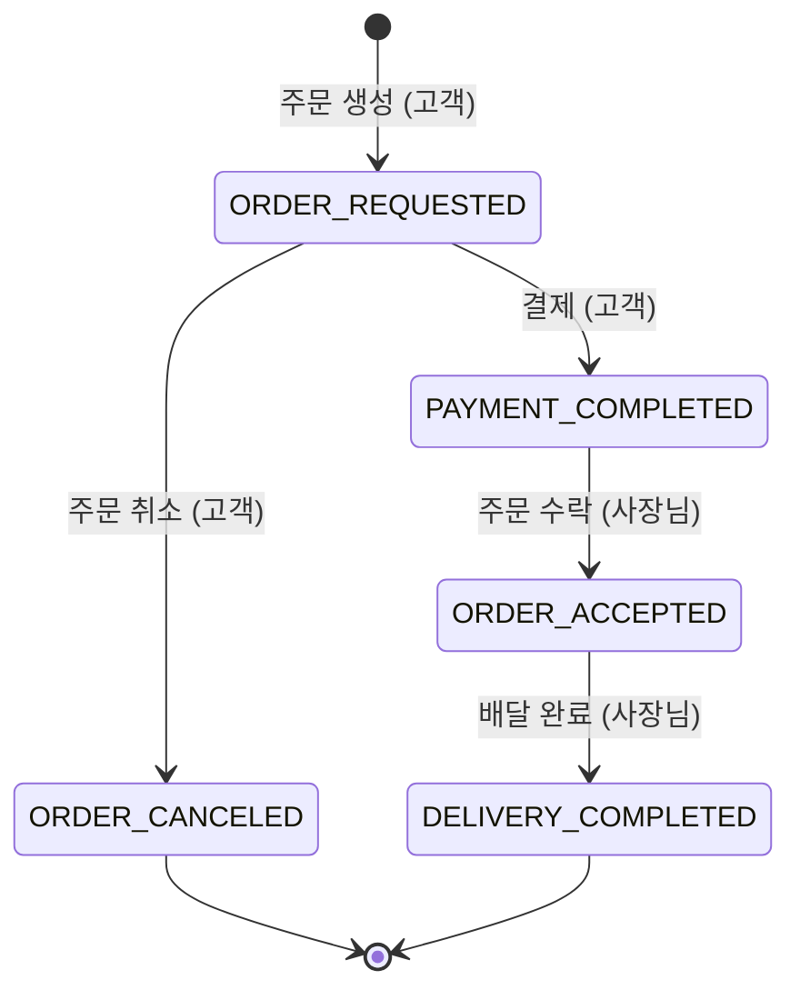
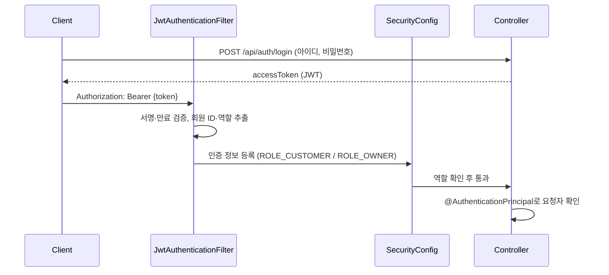

# 1. 서비스 소개

**사장님이 메뉴를 등록하고, 고객이 주문·결제하면, 사장님이 주문을 수락해 배달까지 완료하는 배달 주문 백엔드 API**입니다.

| 역할 | 할 수 있는 일 |
| --- | --- |
| 사장님 (`OWNER`) | 메뉴 등록·수정·삭제, 본인 메뉴에 들어온 주문 조회, 주문 수락·배달 완료 처리 |
| 고객 (`CUSTOMER`) | 메뉴 조회, 주문 생성·취소, 카드 결제, 본인 주문·결제 내역 조회 |
| 비회원 | 회원가입, 로그인, 메뉴 조회 |

### 주요 흐름



### 기술 스택

| 구분 | 사용 기술 |
| --- | --- |
| Language | Java 21 |
| Framework | Spring Boot 4.1, Spring Web MVC, Spring Data JPA, Spring Security, Bean Validation |
| 인증 | JWT (jjwt 0.12), BCrypt |
| Database | PostgreSQL |
| Build | Gradle |

### 실행 방법

다음 환경변수를 설정한 뒤 실행합니다. PostgreSQL에 `delivery` 데이터베이스가 있어야 합니다.

| 환경변수 | 설명 |
| --- | --- |
| `DB_USERNAME` | PostgreSQL 계정 |
| `DB_PASSWORD` | PostgreSQL 비밀번호 |
| `JWT_SECRET` | JWT 서명 키 (**32자 이상**) |

```bash
./gradlew bootRun
```

# 2. 설계

## ERD



### 엔티티 설계 포인트

- **기본키**: 모든 엔티티가 `GenerationType.IDENTITY`를 사용합니다.
- **연관관계**: 모든 연관관계는 `@ManyToOne(fetch = LAZY)` 단방향입니다.
  - 한 주문에 여러 메뉴를 담을 수 있도록, 주문과 메뉴의 다대다 관계를 중간 엔티티 `OrderMenu`(주문 ↔ 메뉴 + 수량)로 풀었습니다.
- **제약 조건**: 필수값은 `nullable = false`로 지정했습니다. 서비스 검사만으로는 거의 동시에 들어온 요청을 막을 수 없어서 DB에도 unique 제약을 걸었습니다.
  - `users.login_id`: 아이디 중복 가입 방지
  - `payments.order_id`: 중복 결제 방지
- **enum**: `Role`, `OrderStatus`, `PaymentMethod`, `PaymentStatus`는 모두 `EnumType.STRING`으로 저장합니다. enum 순서가 바뀌어도 기존 데이터의 의미가 달라지지 않게 하기 위해서입니다.
- **JPA Auditing**: 모든 엔티티가 `BaseEntity`(`@MappedSuperclass`)를 상속해서 `created_at`과 `updated_at`이 자동으로 기록됩니다.

## 주문 상태



- 상태는 위 화살표 방향으로만 바뀝니다. 역방향 변경이나 단계를 건너뛰는 변경은 `409`입니다.
- 취소는 결제 전(`ORDER_REQUESTED`)에만 가능합니다.
- 상태 전이 규칙은 `Order` 엔티티(`isPayable`, `isCancelable`, `canChangeStatusTo`)가 가지고 있고, 서비스는 요청자 권한을 확인한 뒤 엔티티에 상태 변경을 맡깁니다.

## 패키지 구조

도메인별로 Controller(요청·응답) – Service(비즈니스 로직) – Repository(DB 접근) 3 Layer로 나눴습니다.

```text
com.nbk.delivery_order
├── domain
│   ├── auth       # 로그인 (JWT 발급)
│   ├── user       # 회원가입, 회원 조회
│   ├── menu       # 메뉴 CRUD (Soft Delete)
│   ├── order      # 주문 생성·조회·상태 변경
│   └── payment    # 결제, 결제 내역 조회
│       ├── controller
│       ├── service
│       ├── repository
│       ├── entity
│       └── dto (request / response)
└── global
    ├── config     # SecurityConfig
    ├── entity     # BaseEntity (JPA Auditing)
    ├── exception  # GlobalExceptionHandler, ErrorResponse
    └── security   # JwtProvider, JwtAuthenticationFilter, AuthUser
```

- 요청과 응답은 모두 DTO(`record`)로 주고받습니다. Entity를 그대로 응답하지 않기 때문에 비밀번호 같은 필드가 노출되지 않습니다.

## 인증·인가



- **JWT**
  - 토큰에는 회원 ID(`sub`), 로그인 아이디, 역할, 만료 시간(1시간)을 담습니다.
  - 비밀번호 같은 민감정보는 담지 않습니다.
  - 요청자는 요청 본문이 아니라 토큰에서 꺼냅니다. 그래서 다른 회원인 척 요청할 수 없습니다.
- **인가는 2단계로 나눠서 검증합니다.**

  | 단계 | 위치 | 검증 내용 | 실패 시 |
  | --- | --- | --- | --- |
  | 역할 | `SecurityConfig` | 메뉴 등록·수정·삭제는 OWNER, 주문 생성·결제는 CUSTOMER | `403` |
  | 본인 리소스 | Service | 본인 메뉴만 수정·삭제, 본인 주문만 취소·결제, 본인 메뉴가 들어간 주문만 상태 변경 | `403` |

- **비밀번호**는 BCrypt로 단방향 해시해서 저장합니다.

## 주요 설계 결정

| 결정 | 이유 |
| --- | --- |
| **금액은 서버가 계산** | 주문 총액은 DB의 메뉴 가격 × 수량으로, 결제 금액은 주문 총액으로 서버가 정합니다. 클라이언트가 보낸 금액을 믿으면 만 원짜리 주문을 백 원에 결제할 수 있게 됩니다. |
| **메뉴는 Soft Delete** | 주문이 메뉴를 외래키로 참조하고 있어서, 실제로 지우면 FK 오류가 나거나 주문 기록이 깨집니다. `deleted` 표시만 하고, 조회·수정·주문에서는 없는 메뉴(`404`)로 처리합니다. |
| **주문 취소도 상태 변경 API로 처리** | `/cancel` 같은 동사 URL 대신 `PATCH /api/orders/{id}/status`에 `ORDER_CANCELED`를 보냅니다. 같은 URL을 고객과 사장님이 함께 쓰므로, 역할별로 허용되는 상태는 서비스에서 검증합니다. |
| **주문당 결제 1건 (DB unique)** | 결제 취소를 두지 않아 주문 상태가 거꾸로 돌아가는 일이 없습니다. 동시에 들어온 결제 요청도 DB 제약으로 1건만 저장됩니다. |
| **전역 예외 처리** | `GlobalExceptionHandler`가 모든 에러를 `{ status, error, message }` 형식으로 응답합니다. Security 필터에서 나는 401·403도 같은 핸들러로 넘겨 형식을 통일했습니다. |

### 에러 응답 형식

```json
{ "status": 404, "error": "NOT_FOUND", "message": "존재하지 않는 메뉴입니다." }
```

| 상태 코드 | 상황 |
| --- | --- |
| `400` | 요청 값 검증 실패, JSON 형식 오류, 허용되지 않는 enum 값 |
| `401` | 토큰 없음·만료·위조, 로그인 실패 |
| `403` | 역할이 맞지 않음, 본인 리소스가 아님 |
| `404` | 없거나 삭제된 대상 |
| `409` | 아이디 중복, 중복 결제, 허용되지 않는 상태 변경 |

# 3. 필수 기능 12개 & api 명세
## 전체 API
| 도메인 | Method | URL                                | 기능       |
| --- | ------ | ---------------------------------- | -------- |
| 회원  | POST   | `/api/members`                     | 회원가입     |
| 회원  | GET    | `/api/members/{memberId}`          | 회원 조회    |
| 인증  | POST   | `/api/auth/login`                  | 로그인      |
| 메뉴  | POST   | `/api/menus`                       | 메뉴 등록    |
| 메뉴  | GET    | `/api/menus`                       | 메뉴 목록    |
| 메뉴  | GET    | `/api/menus/{menuId}`              | 메뉴 조회    |
| 메뉴  | PATCH  | `/api/menus/{menuId}`              | 메뉴 수정    |
| 메뉴  | DELETE | `/api/menus/{menuId}`              | 메뉴 삭제    |
| 주문  | POST   | `/api/orders`                      | 주문 생성    |
| 주문  | GET    | `/api/orders`                      | 주문 목록    |
| 주문  | PATCH  | `/api/orders/{orderId}/status`     | 주문 취소·상태 변경 |
| 결제  | POST   | `/api/payments`                    | 결제       |
| 결제  | GET    | `/api/payments/{paymentId}`        | 결제 조회    |
| 결제  | GET    | `/api/orders/{orderId}/payments`   | 주문별 결제 조회 |

## API 명세

### 인증

회원가입, 로그인, 메뉴 조회를 제외한 모든 API는 로그인으로 발급받은 토큰이 필요합니다.
요청자는 토큰에서 꺼내므로 요청 바디나 파라미터로 회원 ID를 보내지 않습니다.

```http
Authorization: Bearer {accessToken}
```

| 상황                 | 응답                 |
| ------------------ | ------------------ |
| 토큰 없음 / 만료 / 위조     | `401 Unauthorized` |
| 역할이 맞지 않음 (예: 고객이 메뉴 등록) | `403 Forbidden`    |

| 역할       | 가능한 API                                    |
| -------- | ------------------------------------------ |
| CUSTOMER | 주문 생성·취소, 결제 요청                            |
| OWNER    | 메뉴 등록·수정·삭제, 주문 상태 변경(수락·배달완료)              |
| 공통 (로그인) | 회원 조회, 주문 목록 조회, 결제 조회·이력 조회                |

#### 로그인

```http
POST /api/auth/login
Content-Type: application/json
```

Request

```json
{
  "loginId": "customer01",
  "password": "password123"
}
```

Response `200 OK`

```json
{
  "accessToken": "eyJhbGciOiJIUzI1NiJ9..."
}
```

아이디가 없거나 비밀번호가 틀리면 `401 Unauthorized`

### 1. 회원
| 기능       | Method | URL                       | 설명       |
| -------- | ------ | ------------------------- | -------- |
| 회원가입     | POST   | `/api/members`            | 회원 가입 (누구나) |
| 회원 단건 조회 | GET    | `/api/members/{memberId}` | 회원 정보 조회 (로그인) |

#### 회원가입

```http
POST /api/members
Content-Type: application/json
```

Request

```json
{
  "loginId": "customer01",
  "password": "password123",
  "role": "CUSTOMER"
}
```

| 필드         | 조건                     |
| ---------- | ---------------------- |
| `loginId`  | 필수, 4~20자, 중복 불가       |
| `password` | 필수, 8자 이상 (최대 72자)     |
| `role`     | 필수, `CUSTOMER` 또는 `OWNER` |

Response `201 Created`

```json
{
  "id": 1,
  "loginId": "customer01",
  "role": "CUSTOMER"
}
```

> 비밀번호는 BCrypt로 해시해서 저장하고, 응답에는 담지 않습니다.

| 상황               | 응답              |
| ---------------- | --------------- |
| 값이 비었거나 조건에 맞지 않음 | `400 Bad Request` |
| 이미 있는 아이디        | `409 Conflict`  |

#### 회원 단건 조회

```http
GET /api/members/1
Authorization: Bearer {accessToken}
```

Response `200 OK`: 회원가입 응답과 같은 형식. 없는 회원이면 `404`

---

## 2. 메뉴
| 기능       | Method | URL                   | 설명       |
| -------- | ------ | --------------------- | -------- |
| 메뉴 등록    | POST   | `/api/menus`          | 메뉴 등록    |
| 메뉴 목록 조회 | GET    | `/api/menus`          | 메뉴 목록 조회 |
| 메뉴 단건 조회 | GET    | `/api/menus/{menuId}` | 메뉴 상세 조회 |
| 메뉴 수정    | PATCH  | `/api/menus/{menuId}` | 메뉴 수정    |
| 메뉴 삭제    | DELETE | `/api/menus/{menuId}` | 메뉴 삭제    |

### 메뉴 등록

```http
POST /api/menus
Content-Type: application/json
```

Request

```json
{
  "name": "치즈버거",
  "price": 8000,
  "description": "고소한 치즈가 들어간 버거"
}
```

Response `201 Created`

```json
{
  "id": 1,
  "name": "치즈버거",
  "price": 8000,
  "description": "고소한 치즈가 들어간 버거",
  "ownerId": 1
}
```

### 메뉴 목록 조회

```http
GET /api/menus
```

Response `200 OK`

```json
[
  {
    "id": 1,
    "name": "치즈버거",
    "price": 8000,
    "description": "고소한 치즈가 들어간 버거",
    "ownerId": 1
  },
  {
    "id": 2,
    "name": "불고기버거",
    "price": 7500,
    "description": "불고기 소스를 사용한 버거",
    "ownerId": 1
  }
]
```

---

## 3. 주문

```text
ORDER_REQUESTED → PAYMENT_COMPLETED → ORDER_ACCEPTED → DELIVERY_COMPLETED
       ↓
ORDER_CANCELED (결제 전에만 가능)
```

| 기능          | Method | URL                            | 설명                     |
| ----------- | ------ | ------------------------------ | ---------------------- |
| 주문 생성       | POST   | `/api/orders`                  | 주문 생성 (CUSTOMER)       |
| 주문 목록 조회    | GET    | `/api/orders`                  | 고객은 본인 주문, 사장님은 본인 메뉴 주문 |
| 주문 취소·상태 변경 | PATCH  | `/api/orders/{orderId}/status` | 고객은 취소, 사장님은 수락·배달완료    |

### 주문 생성

```http
POST /api/orders
Content-Type: application/json
Authorization: Bearer {accessToken}
```

Request

```json
{
  "deliveryAddress": "서울시 강남구 테헤란로 123",
  "orderMenus": [
    { "menuId": 1, "quantity": 2 }
  ]
}
```

> 주문자는 토큰에서 꺼내고, 총액은 서버가 메뉴 가격 × 수량으로 계산합니다.

Response `201 Created`

```json
{
  "id": 1,
  "customerId": 2,
  "deliveryAddress": "서울시 강남구 테헤란로 123",
  "totalPrice": 36000,
  "status": "ORDER_REQUESTED",
  "orderMenus": [
    { "menuId": 1, "menuName": "후라이드 치킨", "quantity": 2 }
  ]
}
```

### 주문 목록

```http
GET /api/orders
Authorization: Bearer {accessToken}
```

Response `200 OK`: 주문 생성 응답과 같은 형식의 배열 (최신 주문 순)

### 주문 취소·상태 변경

```http
PATCH /api/orders/{orderId}/status
Content-Type: application/json
Authorization: Bearer {accessToken}
```

Request

```json
{ "status": "ORDER_CANCELED" }
```

| 요청자      | 허용되는 변경                                              | 거절                                  |
| -------- | ---------------------------------------------------- | ----------------------------------- |
| CUSTOMER | 본인 주문 `ORDER_REQUESTED` → `ORDER_CANCELED`           | 남의 주문·취소 외 상태 `403`, 결제 후 취소 `409` |
| OWNER    | 본인 메뉴 주문 `PAYMENT_COMPLETED` → `ORDER_ACCEPTED` → `DELIVERY_COMPLETED` | 남의 메뉴 주문·취소 요청 `403`, 그 외 변경 `409` |

Response `204 No Content`

---

## 4. 결제

| 기능           | Method | URL                              | 설명           |
| ------------ | ------ | -------------------------------- | ------------ |
| 결제 요청        | POST   | `/api/payments`                  | 주문 결제 (CUSTOMER) |
| 결제 내역 조회     | GET    | `/api/payments/{paymentId}`      | 결제 단건 조회     |
| 주문별 결제 내역 조회 | GET    | `/api/orders/{orderId}/payments` | 주문의 결제 내역 조회 |

- 결제 수단은 `CARD`만 받습니다. 그 외 값은 `400`
- `ORDER_REQUESTED` 상태의 주문만 결제할 수 있고, 결제하면 주문이 `PAYMENT_COMPLETED`가 됩니다.
- 주문 하나에 결제는 한 번만 가능합니다. 중복 결제는 `409`이고, 동시에 들어온 요청도 DB unique 제약으로 막습니다.

### 결제 요청

```http
POST /api/payments
Content-Type: application/json
```

Request

```json
{
  "orderId": 1,
  "paymentMethod": "CARD"
}
```

> 결제 금액은 서버에서 주문의 총 가격(`totalPrice`)으로 결정합니다.

Response `201 Created`

```json
{
  "id": 1,
  "orderId": 1,
  "amount": 16000,
  "paymentMethod": "CARD",
  "status": "COMPLETED",
  "paidAt": "2026-10-08T10:05:00"
}
```

### 주문별 결제 내역 조회

```http
GET /api/orders/1/payments
```

Response `200 OK`

```json
[
  {
    "id": 1,
    "orderId": 1,
    "amount": 16000,
    "paymentMethod": "CARD",
    "status": "COMPLETED",
    "paidAt": "2026-10-08T10:05:00"
  }
]
```